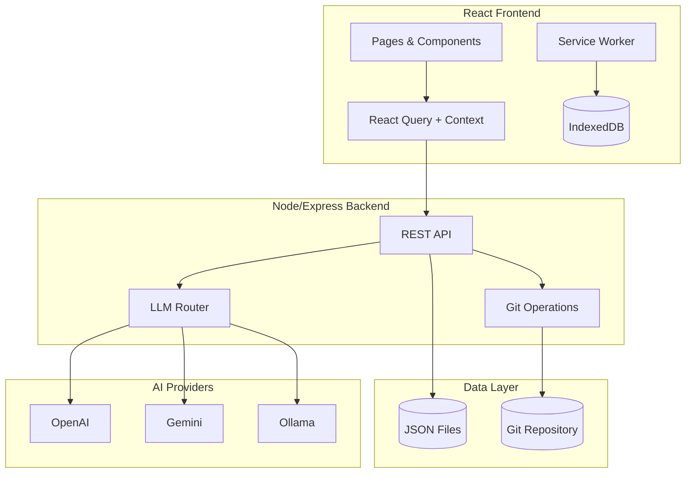

# ScriptureLens - React Architecture

## System Overview



---

## Page Structure (from Streamlit Prototype)

```
App
├── Layout
│   ├── Header (project selector)
│   ├── TabNav (page navigation)
│   └── Sidebar (page-specific controls)
├── Pages
│   ├── ScripturePage (reading view)
│   ├── InterlinearPage (word stacks)
│   ├── ConcordancePage (3-column)
│   ├── DrilldownPage (filter table)
│   ├── CompletionPage (charts)
│   ├── ComparisonPage (side-by-side)
│   ├── DatabasePage (SQL explorer)
│   └── SettingsPage (preferences)
└── Components
    ├── WordCard (interlinear)
    ├── VerseDisplay (scripture)
    ├── LemmaList (concordance)
    └── BookChapterNav
```

---

## API Endpoints

```
GET    /api/projects               # List all projects
GET    /api/projects/:id           # Get project metadata

GET    /api/text/:side/:book       # Get source/target text
GET    /api/alignments/:book       # Get alignment links
PUT    /api/alignments/:book       # Save alignment changes

GET    /api/concordance/:testament # Get lemma index
POST   /api/concordance/search     # Search lemmas

POST   /api/llm/word-study         # AI word study
POST   /api/llm/suggest            # Alignment suggestions

GET    /api/settings               # Get user settings
PUT    /api/settings               # Save settings

POST   /api/git/commit             # Commit changes
POST   /api/git/push               # Push to remote
```

---

## State Management

| State Type      | Solution    | Example                   |
| --------------- | ----------- | ------------------------- |
| Server Data     | React Query | Book data, alignments     |
| UI State        | useState    | Selected lemma, filters   |
| Global Settings | Context     | Theme, font, LLM provider |
| Offline Cache   | IndexedDB   | Pending changes           |

---

## Key Component Interfaces

### WordCard (Interlinear)
```tsx
interface WordCardProps {
  source: string;       // Greek/Hebrew text
  lemma: string;        // Dictionary form
  gloss: string;        // English meaning
  target?: string;      // Aligned translation
  layout: 'card' | 'grid';
  reverse: boolean;     // Target on top
  onClick?: () => void;
}
```

### VerseDisplay (Scripture)
```tsx
interface VerseDisplayProps {
  verseNum: number;
  words: WordWithAlignment[];
  showSourceInfo: boolean;
}
```

---

## Offline Strategy

1. **Service Worker**: Cache static assets + API responses
2. **IndexedDB**: Store pending alignment edits
3. **Sync Queue**: Process offline changes when online
4. **Conflict UI**: Show merge conflicts for resolution

---

## LLM Integration

Providers: OpenAI, Google Gemini, Anthropic, Ollama, Custom

### Features
- Word Study (concordance context)
- Alignment suggestions
- Grammar explanations
- Quality review flags

### Configuration
- API keys via environment variables
- Model selection per provider
- Test connection button
